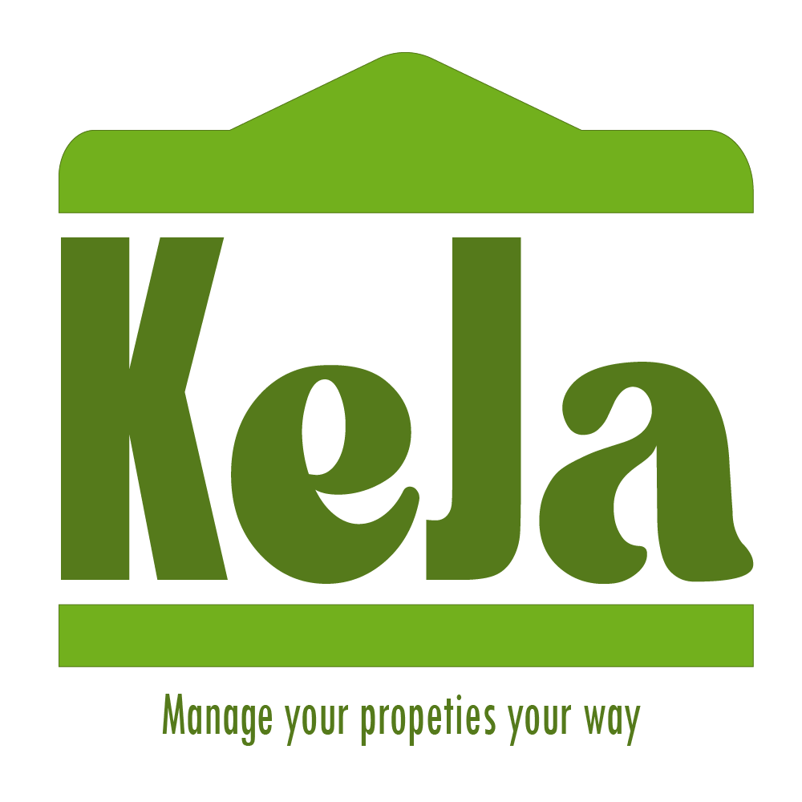
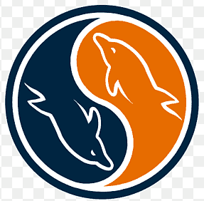
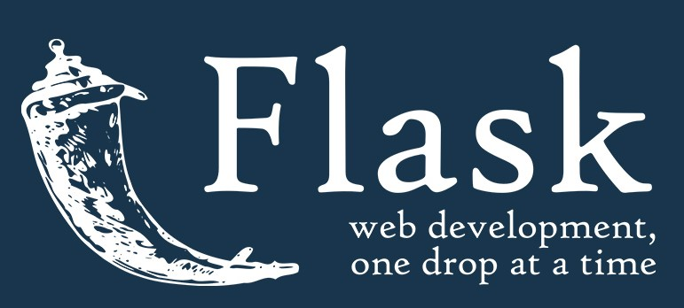

# KEJA PROJECT

#### Landlords usually have more than one apartment. To cater to all those apartments does take a lot of time and expenses. 

#### Keja aims to help Landlords have access to all their properties and Tenants at the palm of their hand. Know who is in which house, who has paid, when he/she is supposed to pay and issues facing their tenants. 

#### Keja is for Landlords that want to take real ownership in managing and dealing with their properties first hand.
 

# Project Languages
   
 
 
 

# Project Technologies
### The project has 3 versions

   A console version. For testing feasability.

   A Flask + Jinja version.

   A Final React + Flask version.
 
 

#

