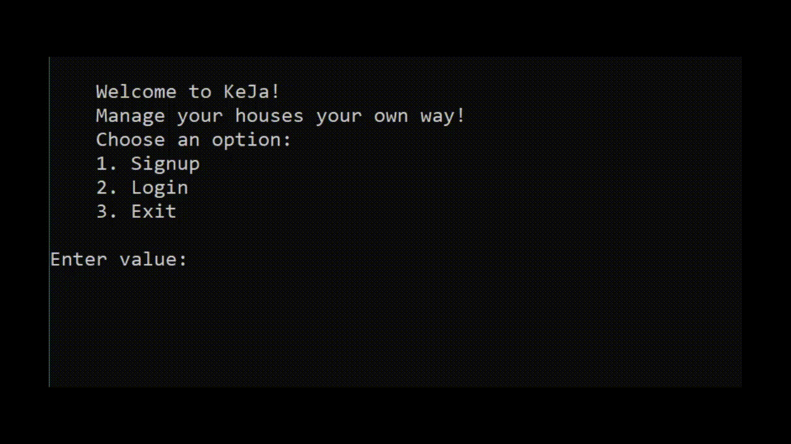

# **KEJA**
<h3><i>Console Version of the app</i></h3>

This is the console version of the app. This project is to test feasability of the overall project

For a light read on the project. I have written an article on Medium. You can read using the link below:

- [Introducing KEJA ](https://medium.com/@tonny.mwambingu/keja-blog-post-3221c9a62daf)

# **Tech Stack**
**Front-End:**
- Html
- Css
- Javascript

**Back-End:**
- Python
- Mysql
- SQLAlchemy

# **Usage**
**Front-End**

For the landing page. I used <a href="https://vitejs.dev/">Vite</a>. A frontend build tool. Used it to setup my development environment. I can hot reload my site with only three commands which was super convenient.

- First clone the repo
- Open a terminal window in the directory
- Then Run `npm run dev`

**Back-End**

Assuming you already cloned the repo. To make it easier setting up. I created a few scripts that will help when working with the backend and the main application.

| console_app/scripts                    | What it does  |
| --------------------------------- | -------- |
| `setup_mysql_db.sql` | A sql script for creating a test DB, user with access to created DB |
| `init_db.sh`  | Creates the tables and fills them with data in the test DB |
| `drop_table.sql`   | Drops all created tables in the test DB  |

**Running the console app and handling data in the db**
- To use the console app or setup the backend. `cd` into the console_app directory.
- You can use either use the `console.py` or `main.py`.
- The `main.py` is the main console application. That has an interactive cli. It has features that are indicative of what to expect in the final version of the Keja project.
- The `console.py` is an interactive shell that is to test and work with models directly from the DB. You can list, create, update and delete models in the db.
- Once in the directory open app a terminal and just run `./console.py` or `./main.py`.

# **Demo**
