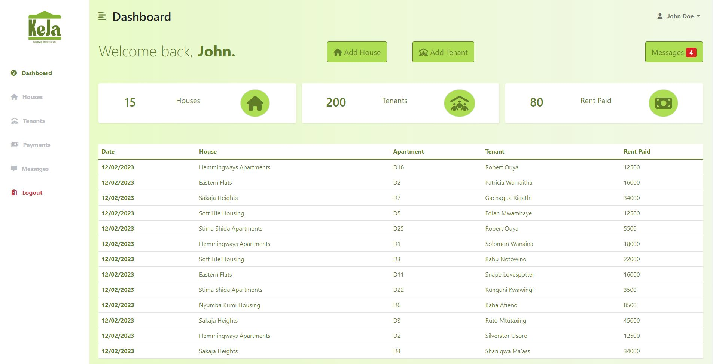

# **KEJA**

<h3><i>Flask-Jinja Version of the app</i></h3>

This is the Flask-Jinja version of the app. A fullstack web application.

For a light read on the project. I am currently writing an article on this:

<!-- - [Introducing KEJA ](https://medium.com/@tonny.mwambingu/keja-blog-post-3221c9a62daf) -->

_<-An Article Link Should be here once written will update->_

# **Tech Stack**

**Front-End:**

-   Html
-   Css -> Bootstrap
-   Javascript
-   Python -> Jinja2

**Back-End:**

-   Python -> Flask
-   Mysql -> Flask-SQLalchemy

**Dependencies:**
| Tool/Library | Version |
| ---------------------------------------------------------------------------------- | ------- |
| [Python](https://wiki.python.org/moin/BeginnersGuide/Download/)| ^3.8.10|
| [MySQL](https://www.digitalocean.com/community/tutorials/how-to-install-mysql-on-ubuntu-20-04) | ^8.0.31 |
| [Flask](https://www.digitalocean.com/community/tutorials/how-to-install-mysql-on-ubuntu-20-04) | ^2.2.3 |
| [Flask-SQLAlchemy](https://pypi.org/project/Flask-SQLAlchemy/) | ^0.4.0 |
| [Flask-Login](https://pypi.org/project/Flask-Login/) | ^0.6.2 |
| [Jinja2](https://pypi.org/project/Jinja2/) | ^3.1.2 |

# **Usage**

**Backend Setup**

The scripts below help setup the db

| flask_jinja_app/scripts | What it does                                                                       |
| ----------------------- | ---------------------------------------------------------------------------------- |
| `setup_mysql_db.sql`    | <i>SQL script that creates a test DB, user with access to created DB</i>           |
| `init_db.sh`            | <i>Bash script that creates the tables and fills them with data in the test DB</i> |

**Running the app and handling data in the db**

-   To use the console app or setup the backend. `cd` into the flask_jinja_app directory.
-   You can either use the `console.py` or `main.py`.
-   The `main.py` is the main flask app which runs on `localhost:5000`.
-   The `console.py` is an interactive shell that is used to test and work with models directly from the DB. You can list, create, update and delete models in the db.
-   Once in the directory open a terminal window and just run `python3 console.py` or `python3 main.py`.
-   To run the SQL scipts just run cat `./scripts/<sql_script.sql> | mysql -keja_flask_user -p`
-   Once everything is setup without errors. You can access the app and interact with the app on localhost:5000.

# **Demo**

 

# **Author**

-   **Tonny Mwambingu** <[mwambingu](https://github.com/mwambingu)>
